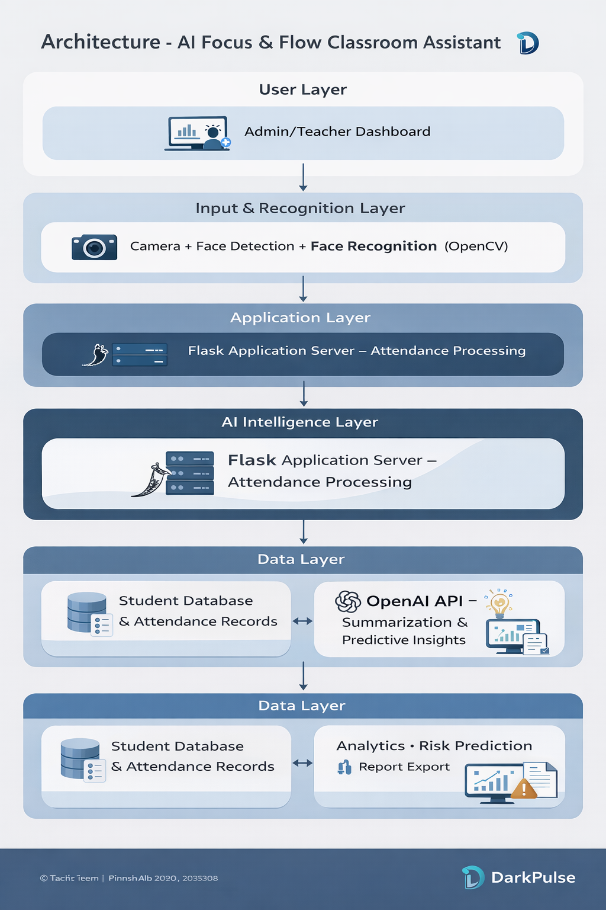

 🚀 DarkPulse – AI Focus & Flow Classroom Assistant  
 Theme: AI Super Productivity – Build for Focus and Flow  
** Team: Dark Pulse  ***

---
 📌 Problem Statement  

Educational institutions lose valuable productive time due to manual attendance systems and lack of intelligent academic insights. Additionally, students often struggle with managing learning content effectively.

There is a need for an AI-powered system that improves classroom productivity, reduces administrative workload, and enhances student focus and knowledge retention.

💡 Solution Overview  

DarkPulse is an AI-powered classroom productivity assistant that combines Face Recognition with intelligent AI analysis to enhance focus and flow within classrooms..

The system:

- Automates attendance using real-time face recognition  
- Prevents proxy attendance  
- Saves classroom time  
- Stores data securely in a digital database  
- Uses AI to generate lecture summaries  
- Provides attendance analytics & insights  
- Identifies students at risk based on attendance patterns  

 🏗 System Architecture  

The system consists of the following components:

1️⃣ Face Recognition Layer  
- Camera captures real-time video  
- OpenCV detects and recognizes students  
- Attendance automatically recorded.

2️⃣ Backend Server  
- Handles attendance logic  
- Stores student and attendance data  
- Connects to AI module  

3️⃣ AI Intelligence Layer  
- Lecture summarization  
- Attendance pattern analysis  
- Risk prediction insights  

4️⃣ Database  
- Stores student information  
- Attendance records  
- AI-generated summaries  

5️⃣ Dashboard  
- Displays attendance reports  
- Shows AI insights  
- Allows export (CSV/Excel)  

🛠 Tech Stack  

- Python (OpenCV)  
- Flask Backend  
- OpenAI API (LLM Integration)  
- MongoDB / MySQL  
- HTML/CSS Frontend

## 📊 System Architecture Diagram

## Local host link
http://10.245.73.54:5000
